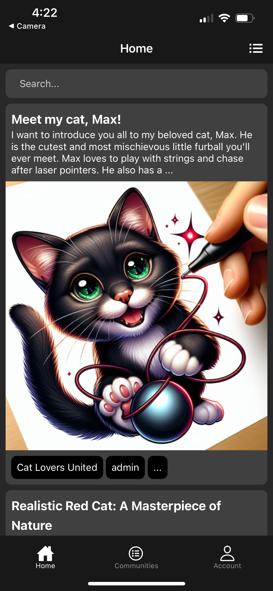
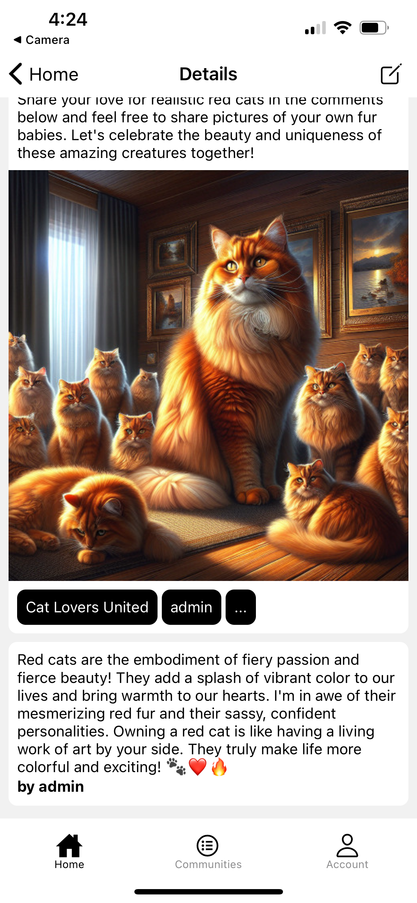
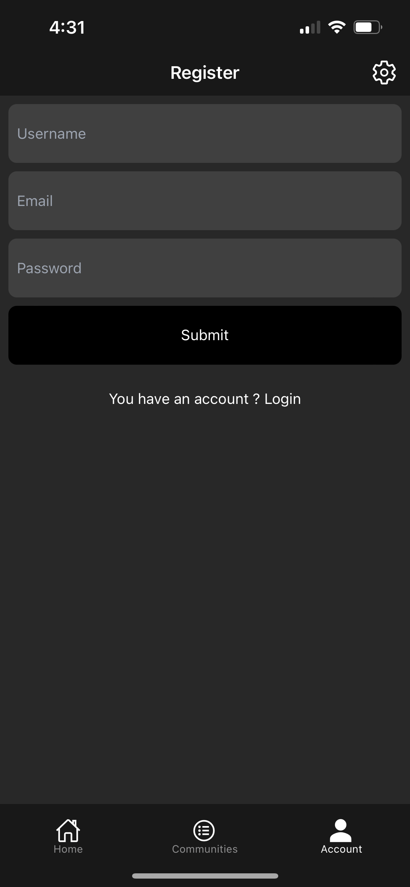
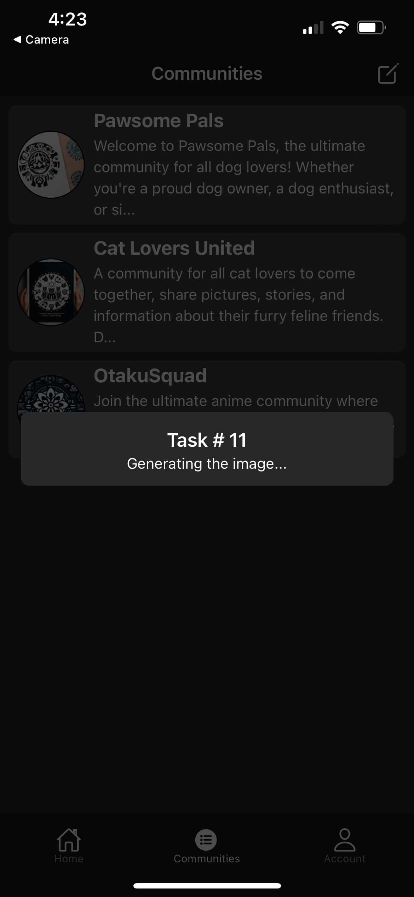
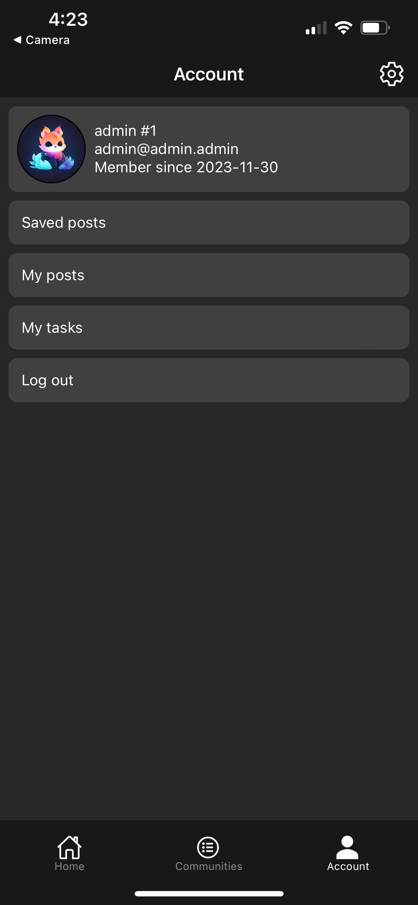

# Akio

Originally, this application was a Reddit client for iOS and Android. However, in response to some significant changes in their API, I chose to pivot the project and completely remove anything related to Reddit. This project was primarily an exercise to showcase my capabilities, and the transition to a completely new backend aligns with that direction. Making the backend standalone also allows me to further expand the concept and incorporate other technologies that I find interesting. The content of that app is generated on request with OpenAI.

## Screens

    
    
    
    
    

